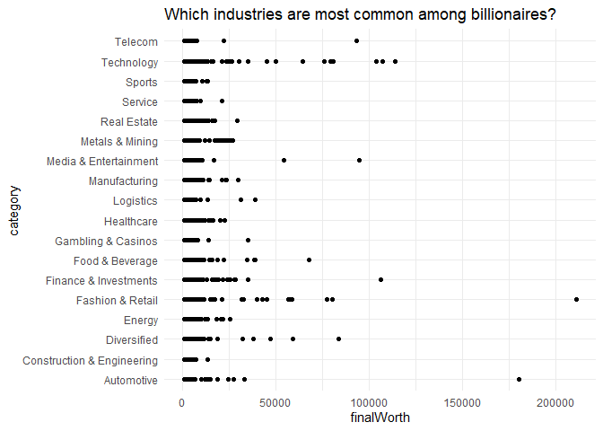
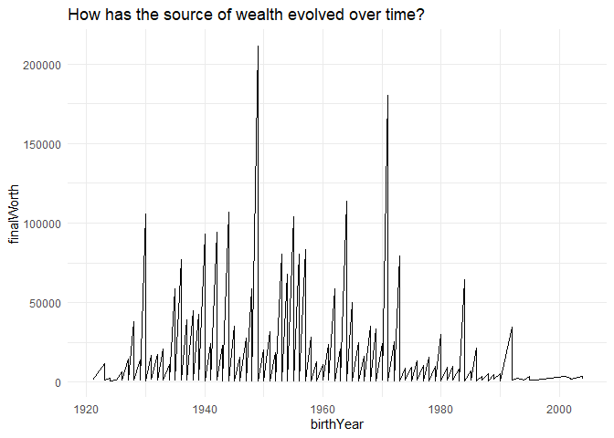
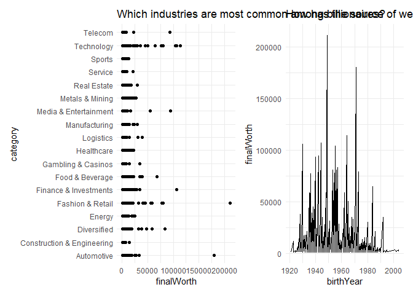
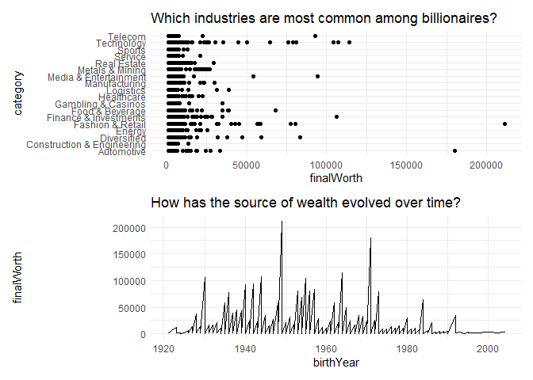
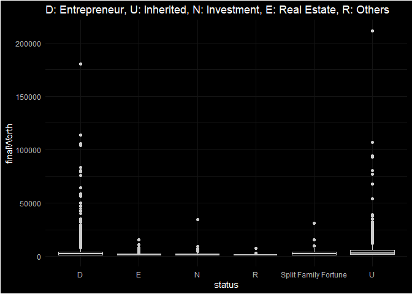

How To Make A Billion
================

Data Source Link:

<https://www.kaggle.com/datasets/nelgiriyewithana/billionaires-statistics-dataset>

# Data Prep Tasks:

``` r
data <- read.csv("data/Billionaires Statistics Dataset.csv") 
str(data)   
```

    ## 'data.frame':    2640 obs. of  33 variables:
    ##  $ rank                                      : int  1 2 3 4 5 6 7 8 9 10 ...
    ##  $ finalWorth                                : int  211000 180000 114000 107000 106000 104000 94500 93000 83400 80700 ...
    ##  $ category                                  : chr  "Fashion & Retail" "Automotive" "Technology" "Technology" ...
    ##  $ personName                                : chr  "Bernard Arnault & family" "Elon Musk" "Jeff Bezos" "Larry Ellison" ...
    ##  $ country                                   : chr  "France" "United States" "United States" "United States" ...
    ##  $ city                                      : chr  "Paris" "Austin" "Medina" "Lanai" ...
    ##  $ source                                    : chr  "LVMH" "Tesla, SpaceX" "Amazon" "Oracle" ...
    ##  $ industries                                : chr  "Fashion & Retail" "Automotive" "Technology" "Technology" ...
    ##  $ organization                              : chr  "LVMH Moët Hennessy Louis Vuitton" "Tesla" "Amazon" "Oracle" ...
    ##  $ selfMade                                  : logi  FALSE TRUE TRUE TRUE TRUE TRUE ...
    ##  $ status                                    : chr  "U" "D" "D" "U" ...
    ##  $ gender                                    : chr  "M" "M" "Male" "M" ...
    ##  $ lastName                                  : chr  "Arnault" "Musk" "Bezos" "Ellison" ...
    ##  $ firstName                                 : chr  "Bernard" "Elon" "Jeff" "Larry" ...
    ##  $ title                                     : chr  "Chairman and CEO" "CEO" "Chairman and Founder" "CTO and Founder" ...
    ##  $ date                                      : chr  "04-04-2023 05:01" "04-04-2023 05:01" "04-04-2023 05:01" "04-04-2023 05:01" ...
    ##  $ countryOfCitizenship                      : chr  "France" "United States" "United States" "United States" ...
    ##  $ state                                     : chr  "" "Texas" "Washington" "Hawaii" ...
    ##  $ residenceStateRegion                      : chr  "" "South" "West" "West" ...
    ##  $ birthYear                                 : int  1949 1971 1964 1944 1930 1955 1942 1940 1957 1956 ...
    ##  $ birthMonth                                : int  3 6 1 8 8 10 2 1 4 3 ...
    ##  $ birthDay                                  : int  5 28 12 17 30 28 14 28 19 24 ...
    ##  $ cpi_country                               : num  110 117 117 117 117 ...
    ##  $ cpi_change_country                        : num  1.1 7.5 7.5 7.5 7.5 7.5 7.5 3.6 7.7 7.5 ...
    ##  $ gdp_country                               : chr  "$2,715,518,274,227 " "$21,427,700,000,000 " "$21,427,700,000,000 " "$21,427,700,000,000 " ...
    ##  $ gross_tertiary_education_enrollment       : num  65.6 88.2 88.2 88.2 88.2 88.2 88.2 40.2 28.1 88.2 ...
    ##  $ gross_primary_education_enrollment_country: num  102 102 102 102 102 ...
    ##  $ life_expectancy_country                   : num  82.5 78.5 78.5 78.5 78.5 78.5 78.5 75 69.4 78.5 ...
    ##  $ tax_revenue_country_country               : num  24.2 9.6 9.6 9.6 9.6 9.6 9.6 13.1 11.2 9.6 ...
    ##  $ total_tax_rate_country                    : num  60.7 36.6 36.6 36.6 36.6 36.6 36.6 55.1 49.7 36.6 ...
    ##  $ population_country                        : int  67059887 328239523 328239523 328239523 328239523 328239523 328239523 126014024 1366417754 328239523 ...
    ##  $ latitude_country                          : num  46.2 37.1 37.1 37.1 37.1 ...
    ##  $ longitude_country                         : num  2.21 -95.71 -95.71 -95.71 -95.71 ...

``` r
data$gdp_country <- gsub(pattern = ",|\\$|\\s",
                         replacement ="",
                         data$gdp_country)

data$gdp_country <- as.numeric(data$gdp_country)
```

Used ‘gsub’ to remove commas in my GDP country column, then changed it
to numeric just so if I can make any calculations in future.

``` r
library(stringr)

data$gender <- str_extract(data$gender, "[FM]")
```

``` r
library(lubridate)
```

    ## 
    ## Attaching package: 'lubridate'

    ## The following objects are masked from 'package:base':
    ## 
    ##     date, intersect, setdiff, union

``` r
data$DOB <- as.Date(data$birthYear,data$birthMonth,data$birthDay)
str(data)
```

    ## 'data.frame':    2640 obs. of  34 variables:
    ##  $ rank                                      : int  1 2 3 4 5 6 7 8 9 10 ...
    ##  $ finalWorth                                : int  211000 180000 114000 107000 106000 104000 94500 93000 83400 80700 ...
    ##  $ category                                  : chr  "Fashion & Retail" "Automotive" "Technology" "Technology" ...
    ##  $ personName                                : chr  "Bernard Arnault & family" "Elon Musk" "Jeff Bezos" "Larry Ellison" ...
    ##  $ country                                   : chr  "France" "United States" "United States" "United States" ...
    ##  $ city                                      : chr  "Paris" "Austin" "Medina" "Lanai" ...
    ##  $ source                                    : chr  "LVMH" "Tesla, SpaceX" "Amazon" "Oracle" ...
    ##  $ industries                                : chr  "Fashion & Retail" "Automotive" "Technology" "Technology" ...
    ##  $ organization                              : chr  "LVMH Moët Hennessy Louis Vuitton" "Tesla" "Amazon" "Oracle" ...
    ##  $ selfMade                                  : logi  FALSE TRUE TRUE TRUE TRUE TRUE ...
    ##  $ status                                    : chr  "U" "D" "D" "U" ...
    ##  $ gender                                    : chr  "M" "M" "M" "M" ...
    ##  $ lastName                                  : chr  "Arnault" "Musk" "Bezos" "Ellison" ...
    ##  $ firstName                                 : chr  "Bernard" "Elon" "Jeff" "Larry" ...
    ##  $ title                                     : chr  "Chairman and CEO" "CEO" "Chairman and Founder" "CTO and Founder" ...
    ##  $ date                                      : chr  "04-04-2023 05:01" "04-04-2023 05:01" "04-04-2023 05:01" "04-04-2023 05:01" ...
    ##  $ countryOfCitizenship                      : chr  "France" "United States" "United States" "United States" ...
    ##  $ state                                     : chr  "" "Texas" "Washington" "Hawaii" ...
    ##  $ residenceStateRegion                      : chr  "" "South" "West" "West" ...
    ##  $ birthYear                                 : int  1949 1971 1964 1944 1930 1955 1942 1940 1957 1956 ...
    ##  $ birthMonth                                : int  3 6 1 8 8 10 2 1 4 3 ...
    ##  $ birthDay                                  : int  5 28 12 17 30 28 14 28 19 24 ...
    ##  $ cpi_country                               : num  110 117 117 117 117 ...
    ##  $ cpi_change_country                        : num  1.1 7.5 7.5 7.5 7.5 7.5 7.5 3.6 7.7 7.5 ...
    ##  $ gdp_country                               : num  2.72e+12 2.14e+13 2.14e+13 2.14e+13 2.14e+13 ...
    ##  $ gross_tertiary_education_enrollment       : num  65.6 88.2 88.2 88.2 88.2 88.2 88.2 40.2 28.1 88.2 ...
    ##  $ gross_primary_education_enrollment_country: num  102 102 102 102 102 ...
    ##  $ life_expectancy_country                   : num  82.5 78.5 78.5 78.5 78.5 78.5 78.5 75 69.4 78.5 ...
    ##  $ tax_revenue_country_country               : num  24.2 9.6 9.6 9.6 9.6 9.6 9.6 13.1 11.2 9.6 ...
    ##  $ total_tax_rate_country                    : num  60.7 36.6 36.6 36.6 36.6 36.6 36.6 55.1 49.7 36.6 ...
    ##  $ population_country                        : int  67059887 328239523 328239523 328239523 328239523 328239523 328239523 126014024 1366417754 328239523 ...
    ##  $ latitude_country                          : num  46.2 37.1 37.1 37.1 37.1 ...
    ##  $ longitude_country                         : num  2.21 -95.71 -95.71 -95.71 -95.71 ...
    ##  $ DOB                                       : Date, format: "1975-05-12" "1975-06-29" ...

Loaded lubridate because this package also helps in doing a lot of
manipulations with Dates. Then added a column called DOB while changing
its class by date.

# Data Analytical Tasks

1.  Which industries are most common among billionaires?

``` r
library(ggplot2)

viz_1 <- ggplot(data, aes(x = finalWorth, y = category)) +
  geom_point(color = "black") +
labs(title = "Which industries are most common among billionaires?") +
  theme_minimal() 
```

Created a scatter plot to check “Which industries are most common among
billionaires.”

2.  How has the source of wealth evolved over time?

``` r
viz_2 <- ggplot(data, aes(x = birthYear, y = finalWorth))+
  geom_line(color = "black") +
    labs(title = "How has the source of wealth evolved over time?") +
  theme_minimal()

viz_1
```

<!-- -->

``` r
viz_2
```

    ## Warning: Removed 76 rows containing missing values (`geom_line()`).

<!-- -->

``` r
library(patchwork)
viz_1 + viz_2
```

    ## Warning: Removed 76 rows containing missing values (`geom_line()`).

<!-- -->

``` r
viz_1 / viz_2
```

    ## Warning: Removed 76 rows containing missing values (`geom_line()`).

<!-- -->

Same here, I wanted to know the relation between time and wealth. So, I
created a line graph.

New thing here is I used patchwork to combine the above two plots. First
I wanted to do side by side then I saw the information is congested and
not looking nice so I made up and down by using viz 1/viz 2 syntax.

3.  Are there any specific trends in the sources of wealth for self-made
    billionaires?

``` r
library(ggdark)
ggplot(data,
       aes(x = status, y = finalWorth)) +
  geom_boxplot() +
  scale_color_brewer(type = "qual", palette = "Set2") +
    labs(title = "D: Entrepreneur, U: Inherited, N: Investment, E: Real Estate, R: Others") +
  dark_theme_minimal() 
```

    ## Inverted geom defaults of fill and color/colour.
    ## To change them back, use invert_geom_defaults().

<!-- -->

New thing here😄

I used ggdark here to get dark themed plots. Created a box and whisker
plots to summarise and see the distribution of the data. Then I reverted
into the geom defaults because when ggdark is used the defaults are
changed.So, we always should definitely change it to default after using
ggdark.

``` r
invert_geom_defaults()
```
